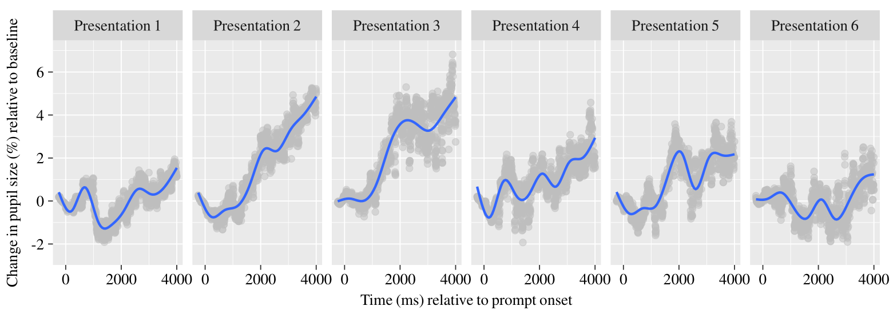
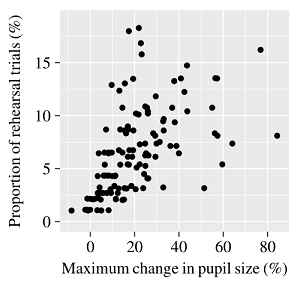
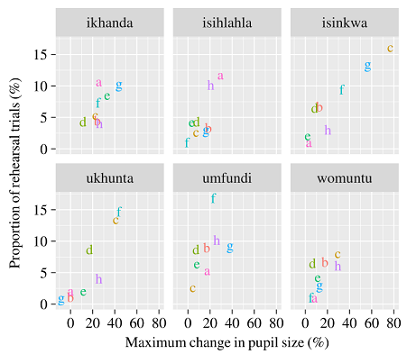

# Slimmer Stampen*
### A smart fact rehearsal application that uses pupil size measurements to adapt to the knowledge level of the user. ###
\* Dutch for "smarter cramming" — inspired by but not related in any way to [SlimStampen](http://www.slimstampen.nl/).

Created for the course User Models (January 2017) together with Kim van Prooijen and Marten de Jager.

Read my paper describing the project: [PDF](MaartenVanDerVelde_UserModels_FinalPaper.pdf).

---

## About
This application lets users learn the English translations of a set of 15 Zulu words in a rehearsal phase and tests them on their new knowledge.
During rehearsal the application measures how pupil size changes in response to each word using an eye tracker.
Words which cause a larger pupil dilation are considered more challenging, since larger dilation is thought to be an indicator of increased mental effort and weaker memory strength.
The application adapts the order of presentation in real-time, so that challenging words are repeated sooner and more often than easy ones.
The goal is directed study, in which difficult items are prioritised over easy items that do not require as much repeating, rather than simply repeating each item the same number of times.

---

## Does it work?
Results from a small pilot study indicate that with repeated presentations of the same word, pupil dilation becomes weaker, which suggests that users may find the word less difficult the more they see it (although the effect on response accuracy is unknown):

The application dedicates more rehearsal time to words which cause larger pupil dilations, as it should:

It also seems to be the case that some words cause larger changes in pupil size than others, which may be indicative of relative differences in difficulty, and that each user finds different words difficult (each letter represents a participant in the pilot):

So, while it looks like the application may distinguish between different kinds of words by measuring pupil responses, it is still unknown to what extent the application's assessment of difficulty lines up with a user's subjective experience of difficulty and objective performance measures.

---

## Usage
The file `slimmer-stampen.osexp` runs in [OpenSesame](http://osdoc.cogsci.nl/).
The application is set up for use with an Eyelink 1000 eye tracker, although OpenSesame does support other types of eye tracker (including a sofware dummy eye tracker): http://osdoc.cogsci.nl/3.1/manual/eyetracking/pygaze/.

